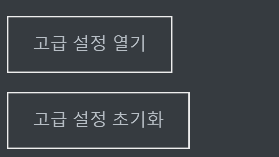
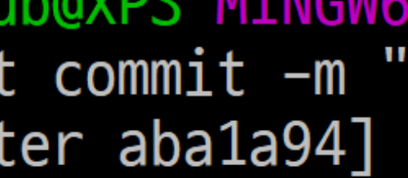

---

layout: post
title: 첫 포스트
tags:

- 포스트

---

# ### 테스트용 포스트

## 테스트

### 테스트


아주우 길게 써보겠습니다.

  [TV리포트=김풀잎 기자] 화제의 인물 낸시랭과 남편 전준주(왕진진)가 새로운 입장을 밝혔다. 부부싸움 관련 해명이다. 

4일 전준주는 이데일리를 통해 “부부싸움이 있었고, 경찰이 출동해 조사를 받은 것이 사실이다”고 밝혔다. 

현재는 화해했고, 지금 함께 있다는 것. 낸시랭이 개인전 준비에 예민해 스트레스가 많았으며, 경제적으로도 어려움이 있었다는 설명이다. 

낸시랭이 방에 들어가 문을 잠그는 바람에, 힘을 주어 유리창을 열다가 깨진 것뿐 둔기로 문을 연적은 없다고도 말했다. 낸시랭도 문이 부서지자 당황하고 놀라 신고를 했다고 덧붙였다. 처벌을 원하지 않는다고도 말했다. 

앞서, 헤럴드 경제는 전준주가 특수손괴 혐의로 경찰에 불구속 입건돼 기소의견으로 검찰에 송치됐다고 보도했다. 

한편 전준주는 과거 두 건의 특수강도강간 혐의로 12년을 복역한 것으로 알려졌다. 2013년 만기 출소한 후 지금까지도 전자발찌를 착용하고 있다는 것. 그리고 지난해 12월 전준주와 낸시랭은 법적으로 부부가 됐다.   






```python
import hi
print('hi')
```

